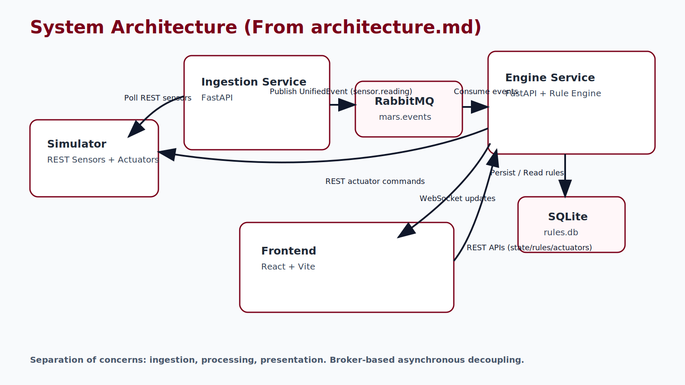
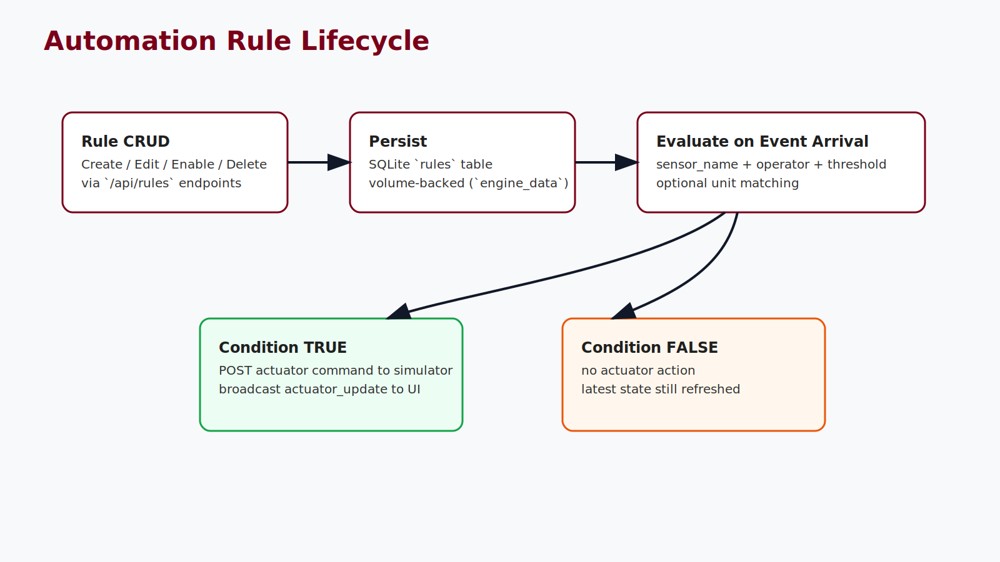
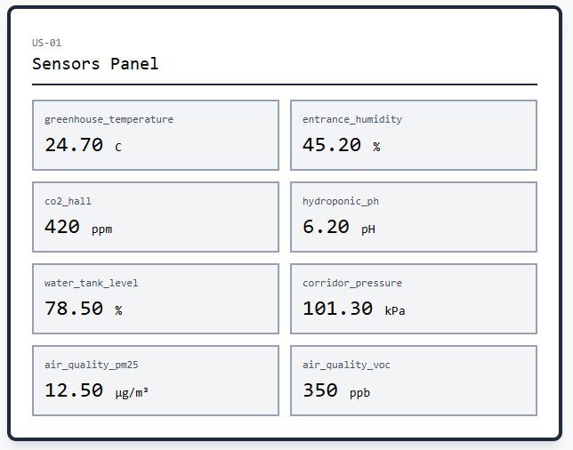
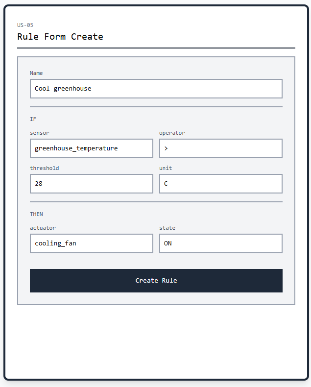
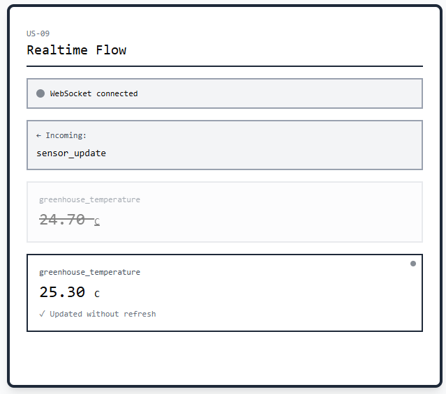
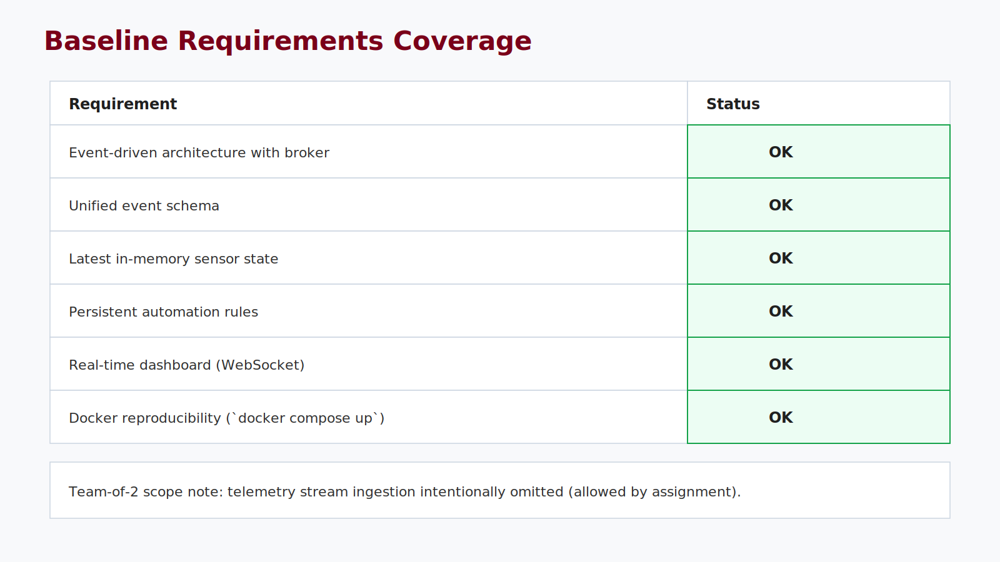

<!-- _class: lead -->


# Mars Habitat Automation Platform
## Mission: Please Don't Die

**Sapienza University of Rome**  
Laboratory of Advanced Programming 2025/2026

Nicola Moscufo (2254216)  
Antonio Rubino (2235484)

**Stack:** `FastAPI` • `RabbitMQ` • `SQLite` • `React` • `Vite` • `Tailwind` • `Docker Compose`

---

# Agenda (15 Minutes)

1. Project goal and constraints
2. Architecture and event flow
3. Rule engine and persistence
4. Dashboard + user stories
5. Live demo plan and final checklist

---

# Problem and Team Scope

- We built a **distributed automation platform** on top of the Mars simulator.
- Input is heterogeneous REST sensor payloads.
- Output is rule-based actuator control and realtime monitoring.

### Team of 2 scope

- Included: REST polling, normalization, broker, rules, dashboard.
- Excluded by assignment: telemetry stream ingestion.

---

# Baseline Requirements Coverage

| Mandatory requirement | Status |
|---|---|
| Event-driven architecture | <span class="ok">Done</span> |
| Multiple backend services | <span class="ok">Done</span> |
| Unified event schema | <span class="ok">Done</span> |
| Latest state in memory | <span class="ok">Done</span> |
| Rule persistence | <span class="ok">Done</span> |
| Realtime dashboard | <span class="ok">Done</span> |
| Docker reproducibility | <span class="ok">Done</span> |

---

# Architecture Overview



<div class="small">Ingestion and processing are decoupled through RabbitMQ. The frontend consumes REST + WebSocket APIs from engine-service.</div>

---

# Containers and Responsibilities

| Service | Responsibility | Interface |
|---|---|---|
| `simulator` | Sensors + actuators API | HTTP (`:8080`) |
| `ingestion-service` | Poll + normalize + publish | HTTP (`:8001`) + AMQP |
| `rabbitmq` | Internal message transport | AMQP (`:5672`), UI (`:15672`) |
| `engine-service` | Rules, state cache, actuator commands | HTTP/WS (`:8002`) |
| `frontend` | Dashboard UI | HTTP (`:3000`) |

---

# Unified Event Contract

```json
{
  "event_id": "uuid-string",
  "timestamp": "2026-03-06T14:00:00.000000+00:00",
  "sensor_name": "greenhouse_temperature",
  "value": 24.7,
  "unit": "C",
  "schema_family": "rest.scalar.v1"
}
```

- Published to exchange `mars.events`
- Routing key `sensor.reading`
- Original payload preserved in `raw_payload`

---

# End-to-End Processing Flow

1. Ingestion discovers and polls REST sensors.
2. Payloads are normalized into `UnifiedEvent`.
3. Events are published to RabbitMQ.
4. Engine consumes and updates `latest_state` cache.
5. Enabled rules are evaluated on each event.
6. Matching rules trigger simulator actuator commands.
7. Frontend receives `sensor_update` and `actuator_update` via WebSocket.

---

# Rule Engine and Persistence

Rule format:
`IF <sensor> <operator> <value> [unit] THEN set <actuator> to ON | OFF`

Supported operators: `<`, `<=`, `=`, `>`, `>=`

**Implementation highlights**
- Rules stored in SQLite (`/data/rules.db`)
- Rules survive restart via Docker volume `engine_data`
- Actuator state cache prevents duplicate commands



---

# Dashboard: Monitoring and Control



<div class="small">Sensors, latest timestamp, actuator states, and manual commands are available in a single operational view.</div>

---

# Dashboard: Rule Management



<div class="small">Operators can create, edit, enable/disable, and delete automation rules from the UI.</div>

---

# Dashboard: Realtime Updates



<div class="small">WebSocket channel pushes live changes without page refresh.</div>

---

# User Stories Coverage

| Story group | IDs | Coverage |
|---|---|---|
| Sensor discovery and latest values | US-01, US-02, US-03 | <span class="ok">Yes</span> |
| Actuator visibility and manual control | US-04, US-10 | <span class="ok">Yes</span> |
| Rule CRUD and enable/disable | US-05, US-06, US-07, US-08 | <span class="ok">Yes</span> |
| Realtime dashboard behavior | US-09 | <span class="ok">Yes</span> |

---

# Demo Plan (Live)

1. Start stack and show container status (`docker compose ps`).
2. Open dashboard and verify live sensor updates.
3. Create a rule and show actuator auto-trigger.
4. Disable the rule and show behavior change.
5. Restart engine and verify rule persistence.
6. Show simulator Swagger (`http://localhost:8080/docs`).

---

<!-- _class: lead center -->
# Final Checklist



<div class="small">All mandatory requirements for the 2-person scope are covered and demonstrable end-to-end.</div>

**Questions?**
